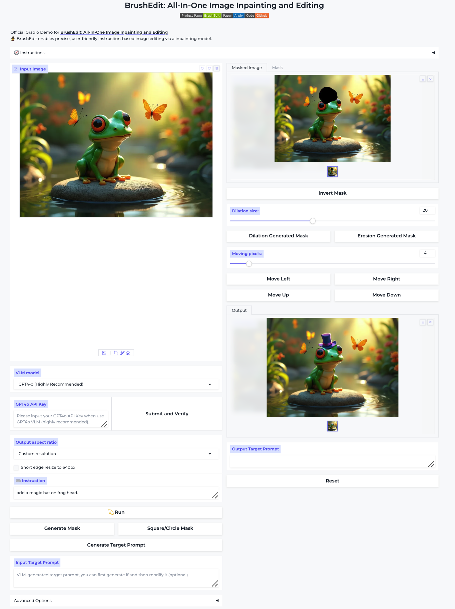

# BrushEdit

😃 This repository contains the implementation of "BrushEdit: All-In-One Image Inpainting and Editing".

Keywords: Image Inpainting, Image Generation, Image Editing, Diffusion Models, MLLM Agent, Instruction-basd Editing

> TL;DR: BrushEdit is an advanced, unified AI agent for image inpainting and editing. <br>
> Main Elements: 🛠️ Fully automated / 🤠 Interactive editing.

>[Yaowei Li](https://github.com/liyaowei-stu)<sup>1*</sup>, [Yuxuan Bian](https://yxbian23.github.io/)<sup>3*</sup>, [Xuan Ju](https://github.com/juxuan27)<sup>3*</sup>, [Zhaoyang Zhang](https://zzyfd.github.io/#/)<sup>2‡</sup>, [Junhao Zhuang](https://github.com/zhuang2002)<sup>4</sup>, [Ying Shan](https://www.linkedin.com/in/YingShanProfile/)<sup>2✉</sup>, [Yuexian Zou](https://www.ece.pku.edu.cn/info/1046/2146.htm)<sup>1✉</sup><br>, [Qiang Xu](https://cure-lab.github.io/)<sup>3✉</sup><br>
><sup>1</sup>Peking University <sup>2</sup>ARC Lab, Tencent PCG  <sup>3</sup>The Chinese University of Hong Kong <sup>4</sup>Tsinghua University <br> <sup>*</sup>Equal Contribution <sup>‡</sup>Project Lead <sup>✉</sup>Corresponding Author

<p align="center">
  <a href="https://liyaowei-stu.github.io/project/BrushEdit/">🌐Project Page</a> |
  <a href="https://arxiv.org/abs/2412.10316">📜Arxiv</a> |
  <a href="https://www.youtube.com/watch?v=nDB7un9Rbdk">📹Video</a> |
  <a href="https://huggingface.co/spaces/TencentARC/BrushEdit">🤗Hugging Face Demo</a> |
  <a href="https://huggingface.co/TencentARC/BrushEdit">🤗Hugging Model</a> |
</p>

https://github.com/user-attachments/assets/fde82f21-8b36-4584-8460-c109c195e614

4K HD Introduction Video: [Youtube](https://www.youtube.com/watch?v=nDB7un9Rbdk).

**📖 Table of Contents**

- [BrushEdit](#brushedit)
  - [TODO](#todo)
  - [🛠️ Pipeline Overview](#️-pipeline-overview)
  - [🚀 Getting Started](#-getting-started)
    - [Environment Requirement 🌍](#environment-requirement-)
    - [Download Checkpoints 💾](#download-checkpoints-)
  - [🏃🏼 Running Scripts](#-running-scripts)
    - [🤗 BrushEidt demo](#-brusheidt-demo)
    - [👻 Demo Features](#-demo-features)
  - [🤝🏼 Cite Us](#-cite-us)
  - [💖 Acknowledgement](#-acknowledgement)
  - [❓ Contact](#-contact)

## TODO

- [X] Release the code of BrushEdit. (MLLM-dirven Agent for Image Editing and Inpainting)
- [X] Release the paper and webpage. More info: [BrushEdit](https://liyaowei-stu.github.io/project/BrushEdit/)
- [X] Release the BrushNetX checkpoint(a more powerful BrushNet).
- [X] Release gradio demo.

## 🛠️ Pipeline Overview

BrushEdit consists of four main steps: (i) Editing category classification: determine the type of editing required. (ii) Identification of the primary editing object: Identify the main object to be edited. (iii) Acquisition of the editing mask and target Caption: Generate the editing mask and corresponding target caption. (iv) Image inpainting: Perform the actual image editing. Steps (i) to (iii) utilize pre-trained MLLMs and detection models to ascertain the editing type, target object, editing masks, and target caption. Step (iv) involves image editing using the dual-branch inpainting model improved BrushNet. This model inpaints the target areas based on the target caption and editing masks, leveraging the generative potential and background preservation capabilities of inpainting models.


## 🚀 Getting Started

### Environment Requirement 🌍

BrushEdit has been implemented and tested on CUDA118, Pytorch 2.0.1, python 3.10.6.

Clone the repo:

```
git clone https://github.com/TencentARC/BrushEdit.git
```

We recommend you first use `conda` to create virtual environment, and install `pytorch` following [official instructions](https://pytorch.org/). For example:

```
conda create -n brushedit python=3.10.6 -y
conda activate brushedit
python -m pip install --upgrade pip
pip install torch==2.0.1 torchvision==0.15.2 torchaudio==2.0.2 --index-url https://download.pytorch.org/whl/cu118
```

Then, you can install diffusers (implemented in this repo) with:

```
pip install -e .
```

After that, you can install required packages thourgh:

```
pip install -r app/requirements.txt
```

### Download Checkpoints 💾

Checkpoints of BrushEdit can be downloaded using the following command.

```
sh app/down_load_brushedit.sh
```


**The ckpt folder contains**

- BrushNetX pretrained checkpoints for Stable Diffusion v1.5 (`brushnetX`)
- Pretrained Stable Diffusion v1.5 checkpoint (e.g., realisticVisionV60B1_v51VAE from [Civitai](https://civitai.com/)). You can use `scripts/convert_original_stable_diffusion_to_diffusers.py` to process other models downloaded from Civitai.
- Pretrained GroundingDINO checkpoint from [offical](https://huggingface.co/ShilongLiu/GroundingDINO/resolve/main/groundingdino_swint_ogc.pth).
- Pretrained SAM checkpoint from [offical](https://dl.fbaipublicfiles.com/segment_anything/sam_vit_h_4b8939.pth).


The checkpoint structure should be like:

```
|-- models
    |-- base_model
        |-- realisticVisionV60B1_v51VAE
            |-- model_index.json
            |-- vae
            |-- ...
        |-- dreamshaper_8
            |-- ...
        |-- epicrealism_naturalSinRC1VAE
            |-- ...
        |-- meinamix_meinaV11
            |-- ...
        |-- ...
    |-- brushnetX
        |-- config.json
        |-- diffusion_pytorch_model.safetensors
    |-- grounding_dino
        |-- groundingdino_swint_ogc.pth
    |-- sam
        |-- sam_vit_h_4b8939.pth
    |-- vlm
        |-- llava-v1.6-mistral-7b-hf
          |-- ...
        |-- llava-v1.6-vicuna-13b-hf
          |-- ...
        |-- Qwen2-VL-7B-Instruct
          |-- ...
        |-- ...
      
```

We provide five base diffusion models, including:

- Dreamshapre_8 is a versatile model that can generate impressive portraits and landscape images.
- Epicrealism_naturalSinRC1VAE is a realistic style model that excels at generating portraits
- HenmixReal_v5c is a model that specializes in generating realistic images of women.
- Meinamix_meinaV11 is a model that excels at generating images in an animated style.
- RealisticVisionV60B1_v51VAE is a highly generalized realistic style model. 

The BrushNetX checkpoint represents an enhanced version of BrushNet, having been trained on a more diverse dataset to improve its editing capabilities, such as deletion and replacement.

We provide two VLM models, including  Qwen2-VL-7B-Instruct and LLama3-LLaa-next-8b-hf.  **We strongly recommend using GPT-4o for reasoning.**  After selecting the VLM model as gpt4-o, enter the API KEY and click the Submit and Verify button. If the output is success, you can use gpt4-o normally. Secondarily, we recommend using the Qwen2VL model.

And you can download more prefromhuggingface_hubimporthf_hub_download, snapshot_downloadtrained VLMs model from [QwenVL](https://huggingface.co/collections/Qwen/qwen2-vl-66cee7455501d7126940800d) and [LLaVA-Next](https://huggingface.co/collections/llava-hf/llava-next-65f75c4afac77fd37dbbe6cf).


## 🏃🏼 Running Scripts

### 🤗 BrushEidt demo

You can run the demo using the script:

```
sh app/run_app.sh 
```

### 👻 Demo Features




💡 <b>Fundamental Features</b>:

<ul>  
    <li> 🎨 <b>Aspect Ratio</b>: Select the aspect ratio of the image. To prevent OOM, 1024px is the maximum resolution.</li>
    <li> 🎨 <b>VLM Model</b>: Select the VLM model. We use preloaded models to save time. To use other VLM models, download them and uncomment the relevant lines in vlm_template.py from our GitHub repo. </li>
    <li> 🎨 <b>Generate Mask</b>: According to the input instructions, generate a mask for the area that may need to be edited. </li>
    <li> 🎨 <b>Square/Circle Mask</b>: Based on the existing mask, generate masks for squares and circles. (The coarse-grained mask provides more editing imagination.) </li>
    <li> 🎨 <b>Invert Mask</b>: Invert the mask to generate a new mask. </li>
    <li> 🎨 <b>Dilation/Erosion Mask</b>: Expand or shrink the mask to include or exclude more areas. </li>
    <li> 🎨 <b>Move Mask</b>: Move the mask to a new position. </li>
    <li> 🎨 <b>Generate Target Prompt</b>: Generate a target prompt based on the input instructions. </li>
    <li> 🎨 <b>Target Prompt</b>: Description for masking area, manual input or modification can be made when the content generated by VLM does not meet expectations. </li>
    <li> 🎨 <b>Blending</b>: Blending brushnet's output and the original input, ensuring the original image details in the unedited areas. (turn off is beeter when removing.) </li>
    <li> 🎨 <b>Control length</b>: The intensity of editing and inpainting. </li>
</ul>

💡 <b>Advanced Features</b>:

<ul>  
    <li> 🎨 <b>Base Model</b>: We use preloaded models to save time. To use other VLM models, download them and uncomment the relevant lines in vlm_template.py from our GitHub repo. </li>
    <li> 🎨 <b>Blending</b>: Blending brushnet's output and the original input, ensuring the original image details in the unedited areas. (turn off is beeter when removing.) </li>
    <li> 🎨 <b>Control length</b>: The intensity of editing and inpainting. </li>
    <li> 🎨 <b>Num samples</b>: The number of samples to generate. </li>
    <li> 🎨 <b>Negative prompt</b>: The negative prompt for the classifier-free guidance. </li>
    <li> 🎨 <b>Guidance scale</b>: The guidance scale for the classifier-free guidance. </li>
</ul>

## 🤝🏼 Cite Us

```
@misc{li2024brushedit,
  title={BrushEdit: All-In-One Image Inpainting and Editing}, 
  author={Yaowei Li and Yuxuan Bian and Xuan Ju and Zhaoyang Zhang and and Junhao Zhuang and Ying Shan and Qiang Xu},
  year={2024},
  eprint={2412.10316},
  archivePrefix={arXiv},
  primaryClass={cs.CV}
}
```

## 💖 Acknowledgement
Our code is modified based on [diffusers](https://github.com/huggingface/diffusers) and [BrushNet](https://github.com/TencentARC/BrushNet) here, thanks to all the contributors!


## ❓ Contact
For any question, feel free to email `liyaowei01@gmail.com`.

## 🌟 Star History
<p align="center">
    <a href="https://star-history.com/#TencentARC/BrushEdit" target="_blank">
        
    </a>
<p>
